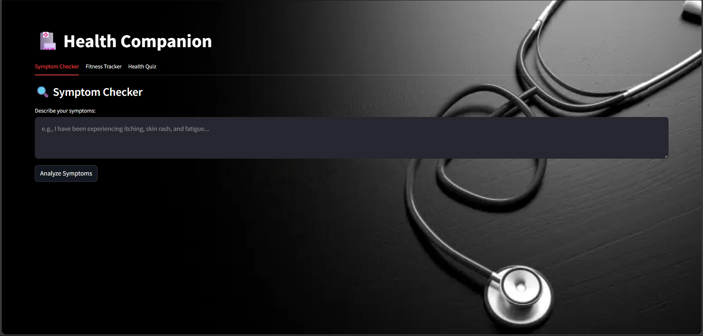

- Model is live -> https://huggingface.co/spaces/amruthsai/health-companion-symptom-checker

# Health Companion - Symptom Checker and Fitness Tracker

  
  
  
  
  
  
  An AI-powered health companion combining symptom analysis with interactive fitness tracking

## ✨ Features

### 🔍 AI Symptom Checker
- NLP-based symptom extraction from natural language
- Deep learning model for disease prediction
- Confidence scores and alternative diagnoses
- Symptom impact visualization

### 🏋️‍♂️ Fitness Tracker
- Daily habit assessment (sleep, diet, exercise)
- Health score calculation (0-10 scale)
- Personalized recommendations
- Progress visualization

### 🧠 Health Quiz
- Interactive multiple-choice questions
- Instant scoring and explanations
- Educational health insights

## 🛠️ Tech Stack

| Component       | Technology |
|----------------|------------|
| Frontend       | Streamlit  |
| Backend        | Python 3.8+|
| Machine Learning | TensorFlow/Keras |
| NLP Processing | Custom symptom extraction |
| Data Storage   | Session state |

## 🚀 How to use?

### 🩺 Symptom Checker
- Describe symptoms in natural language
- View predicted conditions with confidence scores
- Analyze symptom importance

### 🏃 Fitness Tracker
- Log daily habits
- Receive health score
- Get improvement suggestions

### 🧠 Health Quiz
- Answer medical knowledge questions
- Review correct answers
- Track learning progress
